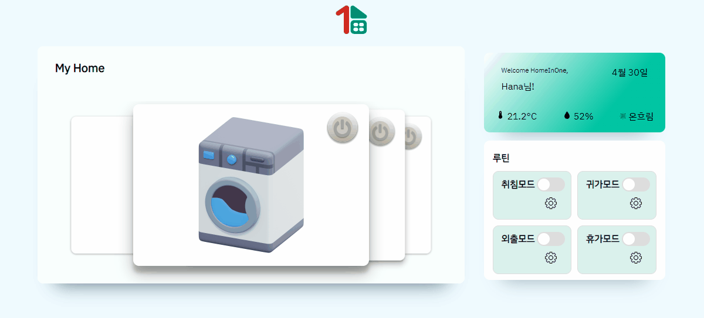
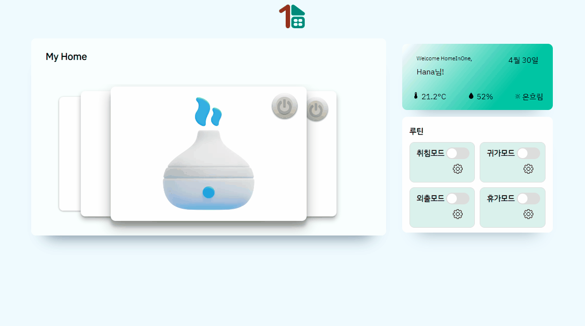

# 🏠 HomeInOne

## 🍰: 링크&로고
> 

> [HomeInOne경험해보기](https://hana-fe-team1.github.io/HomeInOne/)
## :clipboard: 개발환경
> 
> 

## :clipboard: 사용 기술

>### ▶️: Front-end
>> 
>> 
>> 

## :clipboard: 주요 키워드
* 현재 날씨 API
* 사용자 커스텀 루틴
* 가전 ON/OFF
* 에어컨 온도조절
* 세탁기 타이머
* 가습기 습도조절
* 냉장고 온도조절
  

## 📝 Service

